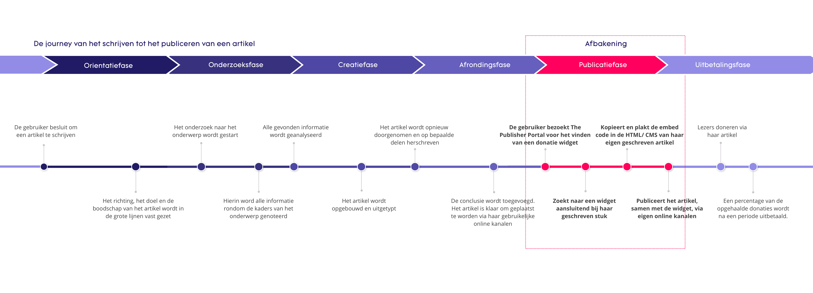

# Customer Journey

Na het opstellen van de User Scenario's ben ik er achtergekomen dat de gebruiker via meerdere wegen binnen kan komen op het platform. Hieruit kon ik de conclusie trekken dat het indekken van alle doelen en scenario's te groot zou zijn voor het duur van dit project. Om mij beter te kunnen focussen heb ik er voor gekozen om hierin een onderdeel uit te werken. Mijn doel hierin is om de gebruiker zo snel mogelijk bij zijn einddoel te krijgen: Het opvragen van een donatie widget.

Kinder heeft hierin aangegeven dat zij verschillende marketing campagnes zullen opzetten om het product onder de aandacht van de doelgroep te gaan krijgen \(zie Kinder Formats &gt; documenten &gt; Marketing en Communicatie\). Daarom heb ik ervoor gekozen om de gebruikers, met enige voorkennis van het platform, te begeleiden in het proces waarin zij op zoek zijn naar een widget. 

