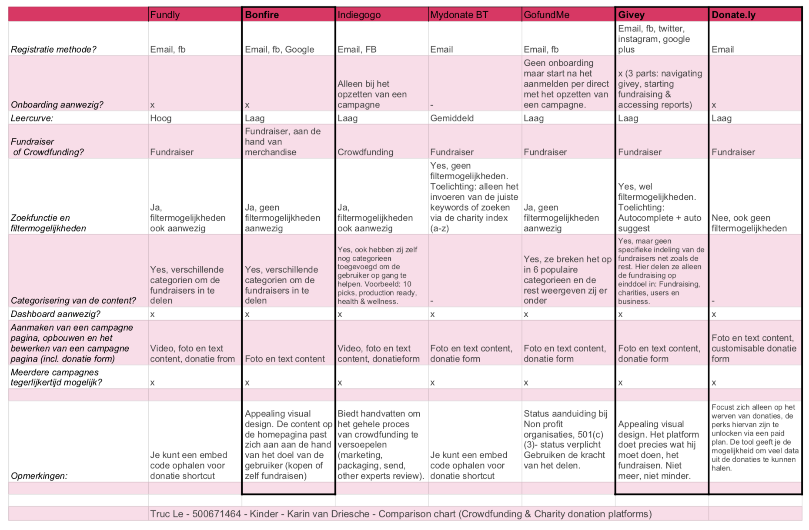

# Comparison Chart



Mijn doel hierbij was voornamelijk gefocust op het analyseren van soortgelijke punten waarmee de competitive analyse is uitgevoerd. 

Om uit te vinden hoe andere digitale producten bepaalde design problemen hebben getackeld, ben ik gaan kijken naar een aantal platformen in fundraising en crowdfunding wereld. 

De globale punten waarmee de digitale producten naast elkaar zijn gelegd:

* On boarding
* Aanmelden & registratie
* Zoeken en vinden van content
* Dashboard
* Overall pro & con’s



Uit de Comparison zijn de volgende bevindingen naar voren gekomen. Voor de volledige Comparison Chart of de bevindingen, kun je terecht in het tabblad "Comparison Chart" of  een van de "Detailed docs".

**Learnings**:  
****_Vanuit de comparison chart zijn er van de 6 producten 3 naar voren gekomen. Deze 3 producten hadden allemaal een bepaalde vorm van een introductie /een onboarding waarin gebruikers informatie gekregen over het gebruik van het platform. De onboarding zorgde ervoor dat de leercurve van het platform aanzienlijk korter werd._

_Een ander belangrijk punt wat zeker meegenomen moet worden was de search. Enkele platformen boden hier geen begeleiding in waardoor het zoeken een stuk lastiger werd. Givey was hierin de enige die autosuggest had verwerkt om sturing te kunnen bieden. Wel is dit natuurlijk afhankelijk van het doel waarmee de gebruiker de website komt bezoeken maar het voelde wel fijn om bij het zoeken hulp te kunnen krijgen. Ook viel het hierin op dat wanneer erg geen zoekresultaten beschikbaar waren, alle platformen hier geen alternatief of aanbeveling in gaven. Pagina's liepen dood, en de zoektocht moest opnieuw beginnen._

\_\_



De tabel hieronder weergeeft de Comparison Chart die is samengesteld aan de hand van de grotere spelers in de crowdfunding en fundraising wereld.  
  
Uit de vergelijking kwamen Bonfire \(\#3\), Donately \(\#2\) en Givey \(\#1\) als het meest potentiële naar voren. Voor de gedetailleerde documenten kun je terecht in de "Comparison Chart \(Fundraising/ Crowdfunding\)" tabblad.




In dit gedetailleerde document ben ik gaan onderzoeken hoe andere digitale producten, die actief zijn in de Fundraising wereld, oplossingen bieden voor mijn soort gelijken design problemen. De analyse van de sterke en minder sterke punten zijn omgeschreven in het document hieronder. Daarnaast heb ik ook gekeken of design patterns/oplossing  geschikt zijn voor het ontwerp van The Publisher Portal.





In dit gedetailleerde document ben ik gaan onderzoeken hoe andere digitale producten, die actief zijn in de Crowdfunding wereld, oplossingen bieden voor mijn soort gelijken design problemen. De analyse van de sterke en minder sterke punten zijn omgeschreven in het document hieronder. Daarnaast heb ik ook gekeken of design patterns/oplossing  geschikt zijn voor het ontwerp van The Publisher Portal.





