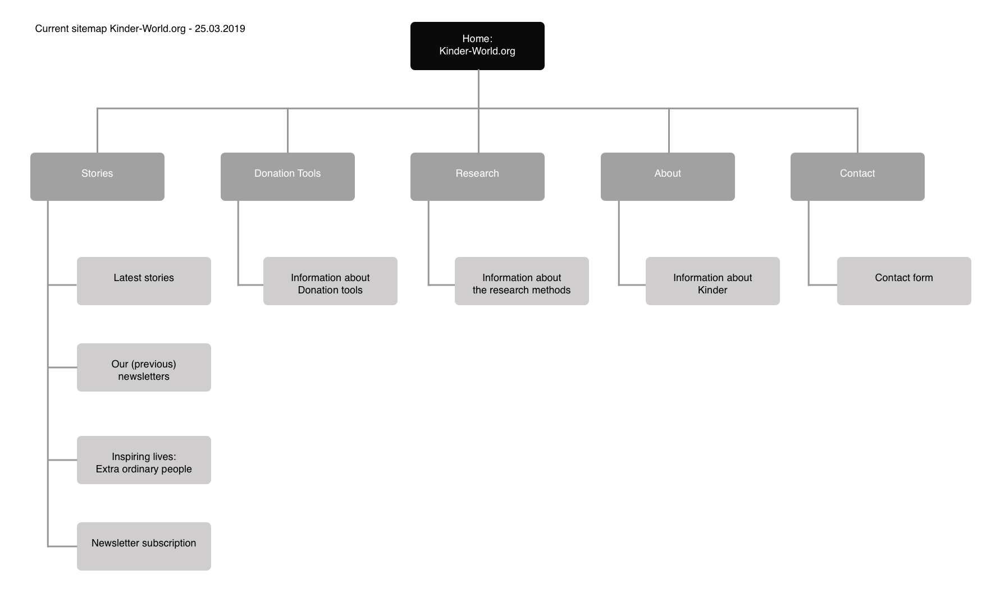

# Sitemap: Kinder World



Om de structuur van het Kinder.World platform beter te kunnen begrijpen heb ik vanuit de product analyse een sitemap van de huidige website opgesteld. 

Hiermee is het duidelijk geworden hoe de website in elkaar zit en waar ik moet zijn voor bepaalde webpagina's. Dit zal mij ook ondersteunen bij het opstellen van de structuur voor The Publisher Portal.







