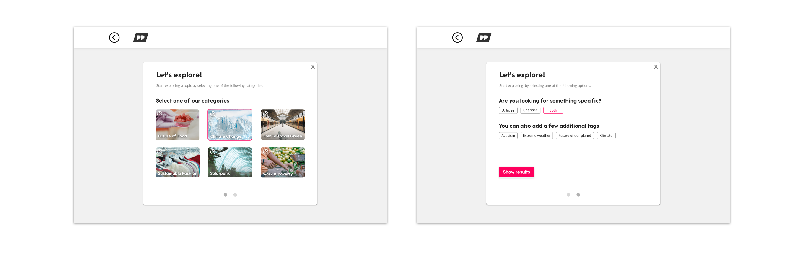
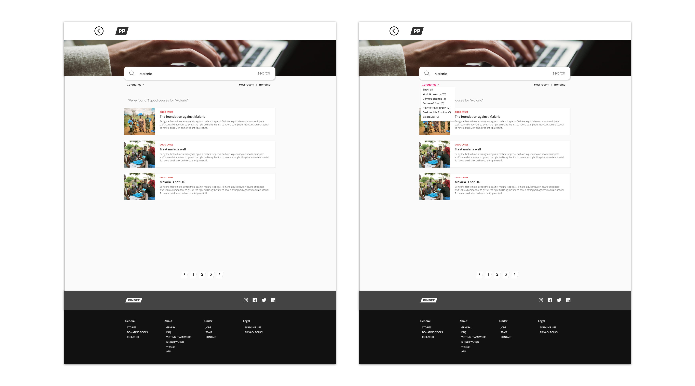
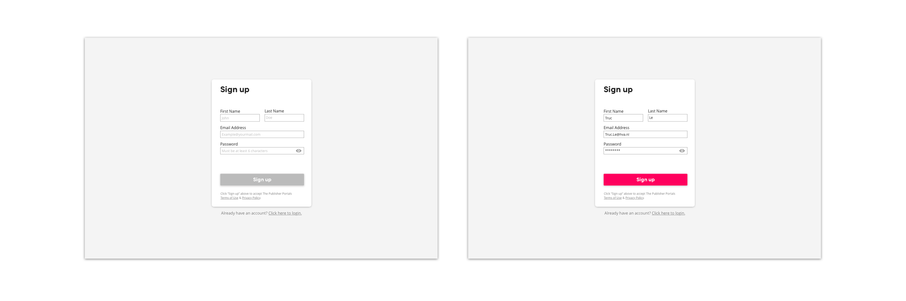
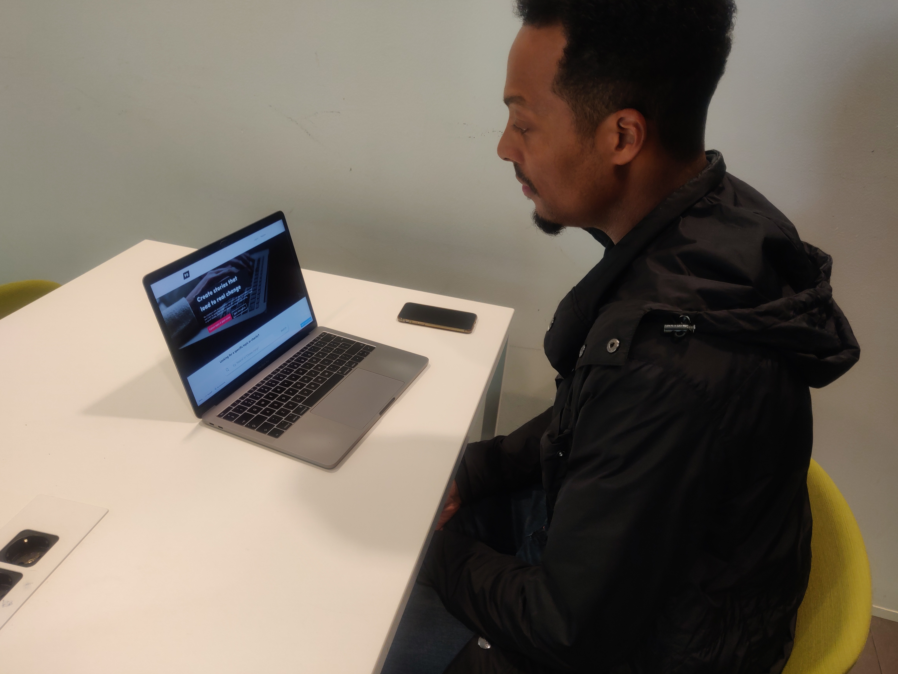
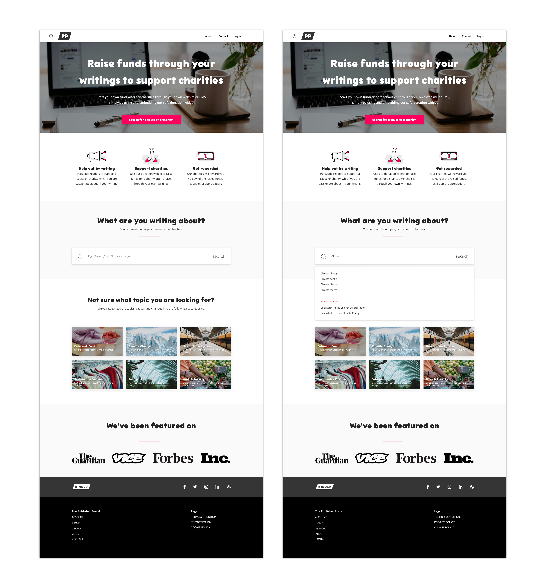
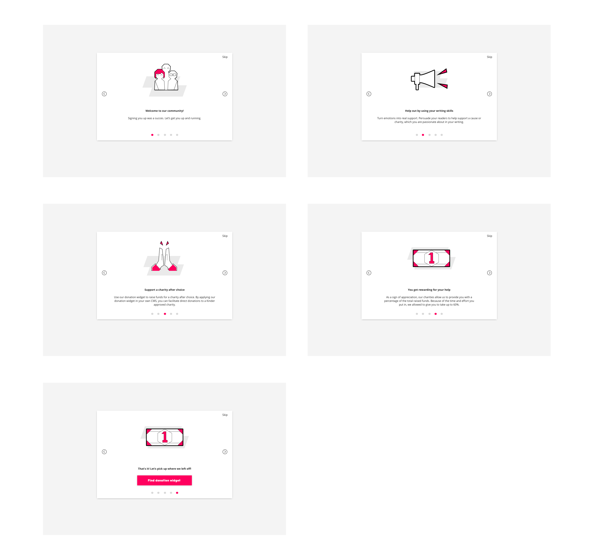
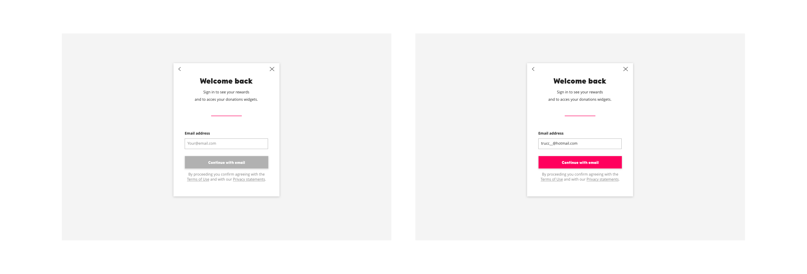
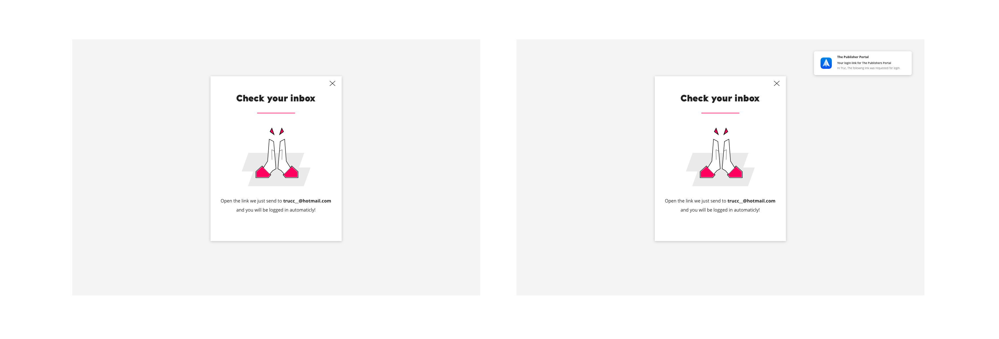

# High fidelity \(Versie 3&4\)

Tijdens deze fase was de stijl van de Kinder World platform als uitgangpunt gebruiker. Later in het proces heb ik enkele templates ontvangen waarop ik mijn huidige designs hebt aangepast.

Hierdoor heeft het ontwerp een iets andere look and feel gekregen. 







**Meer informatie + 3 benefits**  
Vanuit de bevindingen van de  Onboarding + Persuasion onderzoek zijn er nog enkele aanpassingen geweest. Hierin heb ik besloten om de kernwaardes \(wat levert het gebruik van het platform op voor de gebruiker\) van het platform iets hoger op de home pagina te zetten en de meer info knop weg te halen.   
  
Tijdens het voorleggen aan mede studenten viel het op dat niemand gebruik maakte van de meer informatie CTA. Wel viel het op dat iedereen de kopjes van de meer informatie sectie scande. Dit was genoeg aanleiding om deze sectie meer prominent te maken door deze naar boven te schuiven.

**Social proof**  
Ook is hier de keuze gemaakt om social proof toe te voegen. Hierin wordt aangegeven dat Kinder gefeatured is door meerdere grote namen in de journalistiek. Om te testen welke social proof het meest impact zal hebben, zijn er meerdere versie \(Namen van grote nieuwsplatformen, testimonials van gebruikers en de logo's van de goede doelen die zijn goedgekeurd\) gemaakt. Deze zullen voorgelegd worden bij de doelgroep.

**Peer Feedback sessie met Kari, Visual Designer bij Kinder**  
  
**Call to Actions**  
De Call to actions zijn van 3 doelen \(Zoeken van widgets, Verkennen van widgets & meer informatie\) terug gebracht naar 1 doel \(zoeken van widgets\), dit is ontstaan vanuit de bevindingen van de User Interface research \(The principles of User interface design \(\#6 keep one primairy action per screen\) en de bevestiging daarvan uit de Peer review met Kari, Visual Designer.   
  
**Explore functie**  
Een andere ondersteunende reden voor het aanpassen van deze link was de terugkomende feedback vanuit de testers. Zij gaven aan dat de explore functie bijna gelijk was aan de algemene search functie. Hierdoor kwam ik tot het besef dat deze optie helaas dubbel en overbodig werd. Om nog wel gebruikt van de CTA te maken, functioneert deze als een anchored link naar de zoeksectie, deze staat nu een sectie lager op de homepagina.   
  
Ook zijn er meerdere pogingen gedaan om de copy af te stemmen op de doelen van gebruiker.




Vanwege de schakeling naar de aangepaste huisstijl, zijn er enkele elementen visueel veranderd. Daarom wilde ik nog een kleine usability test uit te voeren met de focusdoelgroep. Deze korte sessies waren vooral gericht op de vormgeving en de copywriting van het platform.




**Feedback vanuit het testen:**  
- 40-60% verdienen van de geworven donaties is erg hoog. Het moet ook winstgevend zijn voor de organisatie van het goede doel.  
- De headers van de informatie sectie moeten iets meer aangescherpt worden, veel gebruikers scande deze alleen zonder de tekst daaronder te lezen.  
- De filter "sorteer op" gaf onduidelijkheid, het was hierin niet duidelijk waar hij standaard op gefilterd stond.    
- De categorie omschrijvingen op de landingspagina werden wel gelezen, echter werd er wel aangegeven dat de informatie op de gehele categorie pagina onnodig was.  
- Filters van de search kwamen niet prominent genoeg naar voren. Hierdoor keken twee tester eroverheen. Deze zagen ze later pas toen zij terug scrolden.

De punten zullen na het verwerken in de aanpassingen naar de laatste versie.

  

  







