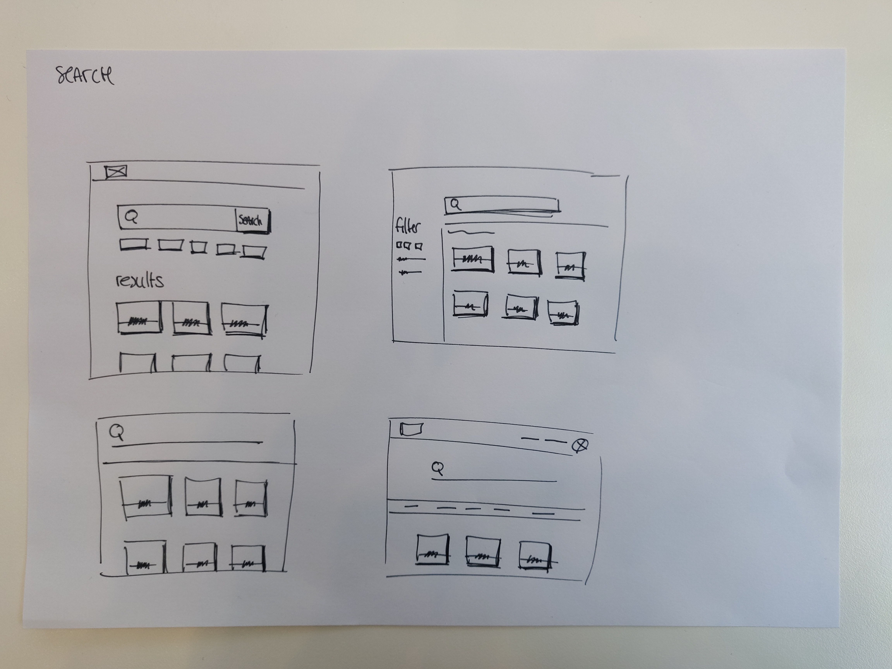
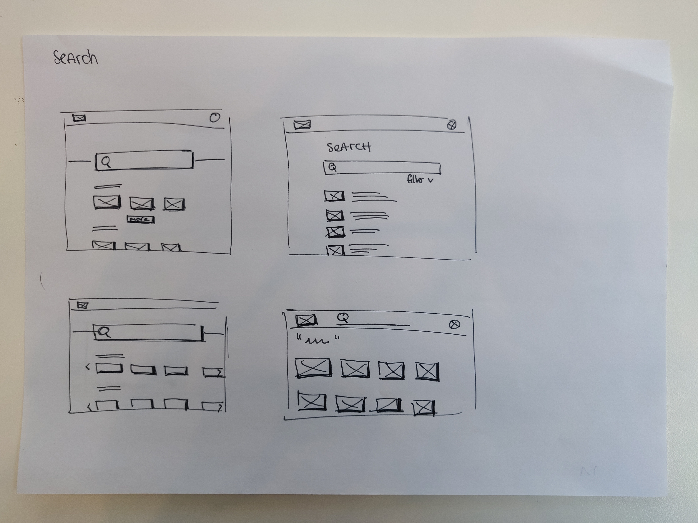
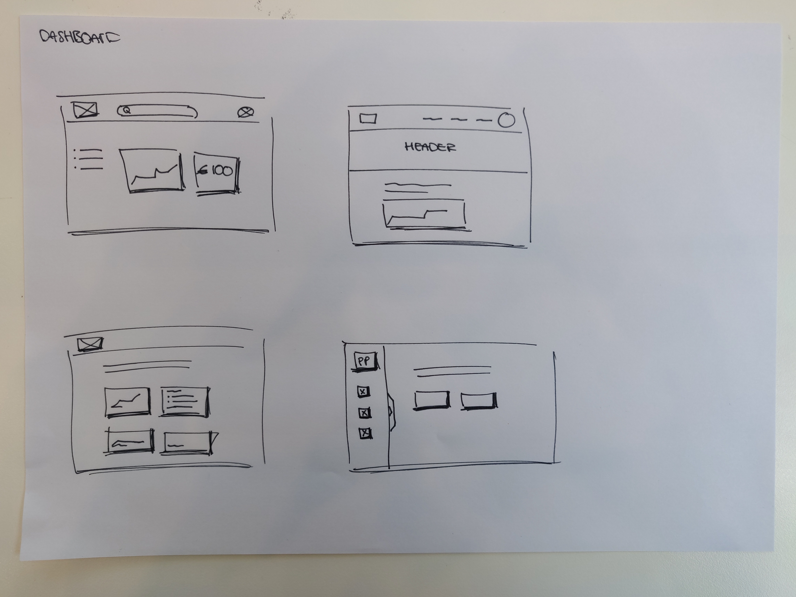
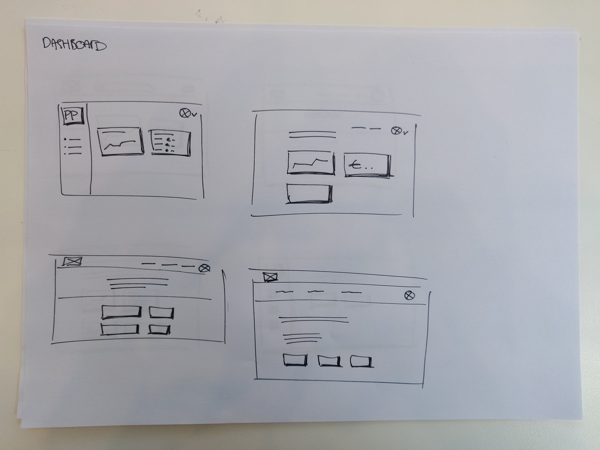
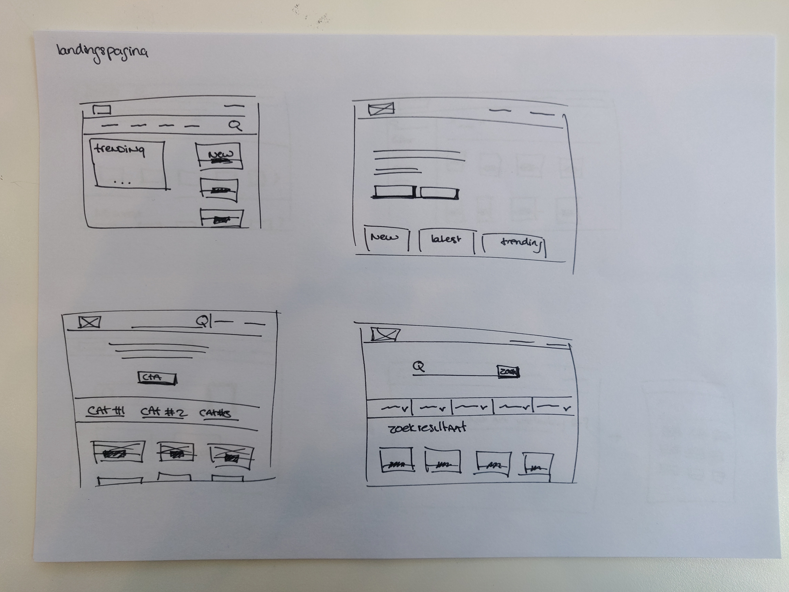
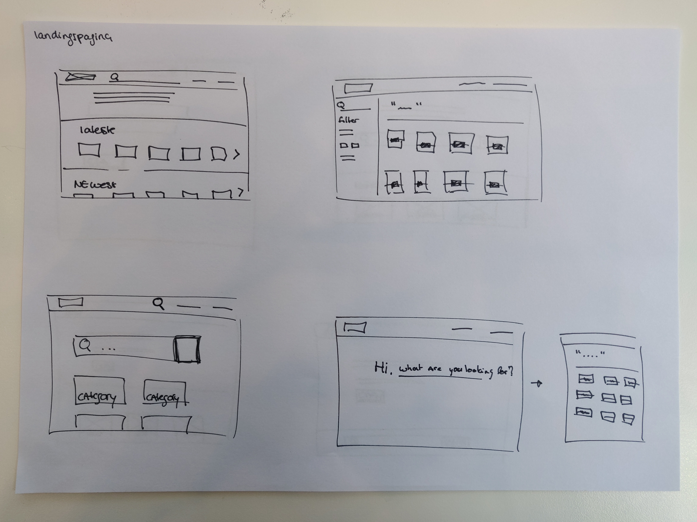
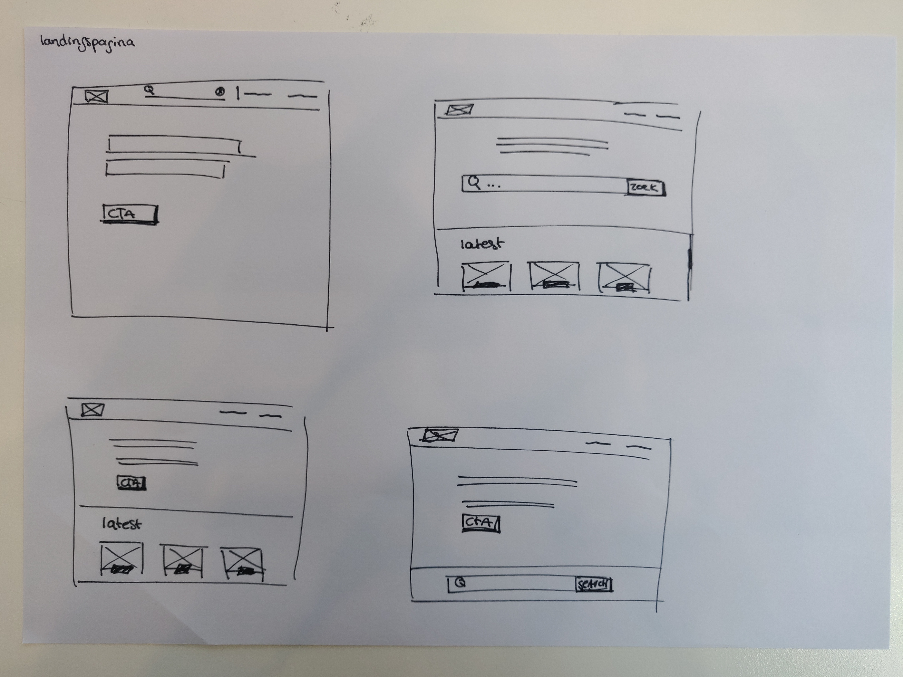

# Idee ontwikkeling \(schetsen\)

Gedurende het proces van creeeren zijn er meerdere ruwe schetsen opgesteld voor hoofdpagina's van het eindproduct: De landingspagina, de dashboard \(account omgeving\) en de zoek & zoekresultaten pagina. 

Tijdens het opzetten van de schetsen is er rekening gehouden het volgende:  
- De gebruikers komen vanuit het niewsplatform \(Kinder.World\) terecht op The Publisher Portal.  
- Hebben de achtergrond informatie over het opvragen van de donatie widget.  

**De zoekresultaten pagina:**  
Doel van deze pagina is ontstaan vanuit de behoefte om te kunnen zoeken \(, filteren\) en het kunnen vinden van de donatie widgets.

**Het dashboard \(account omgeving\):**  
Het doel van deze pagina's is vanuit de behoefte om de inkomende donaties en de bijbehorende donatie widget te kunnen inzien.

**De landingspagina:**  
Het doel van deze pagina is om de gebruiker te kunnen begeleiden naar een van de doelen. Hierin is een combinatie gemaakt van zoeken naar een widget en het verkennen/ontdekken van  widgets/inspiratie via de sectie waarin de laatst / populaire content wordt weergeven.

