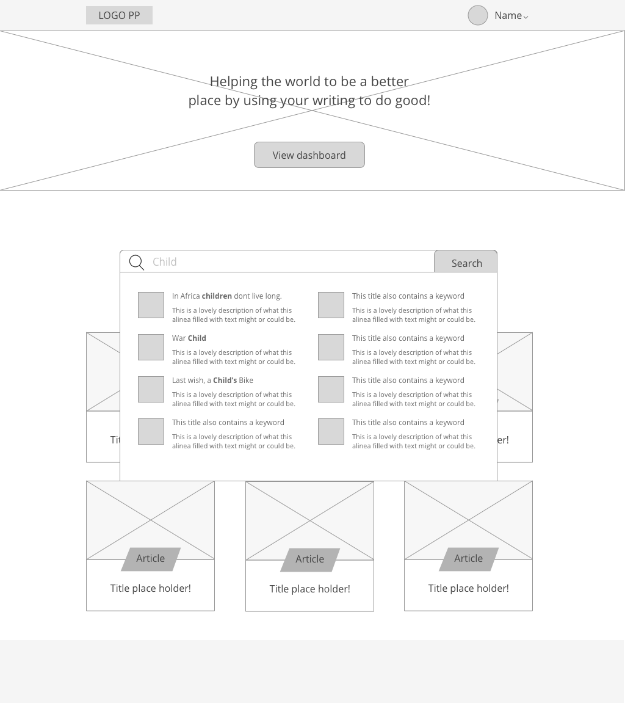
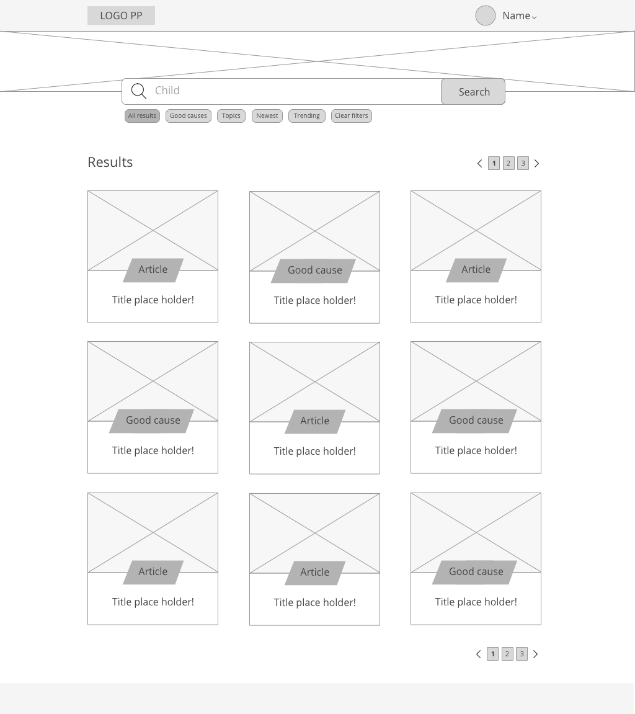
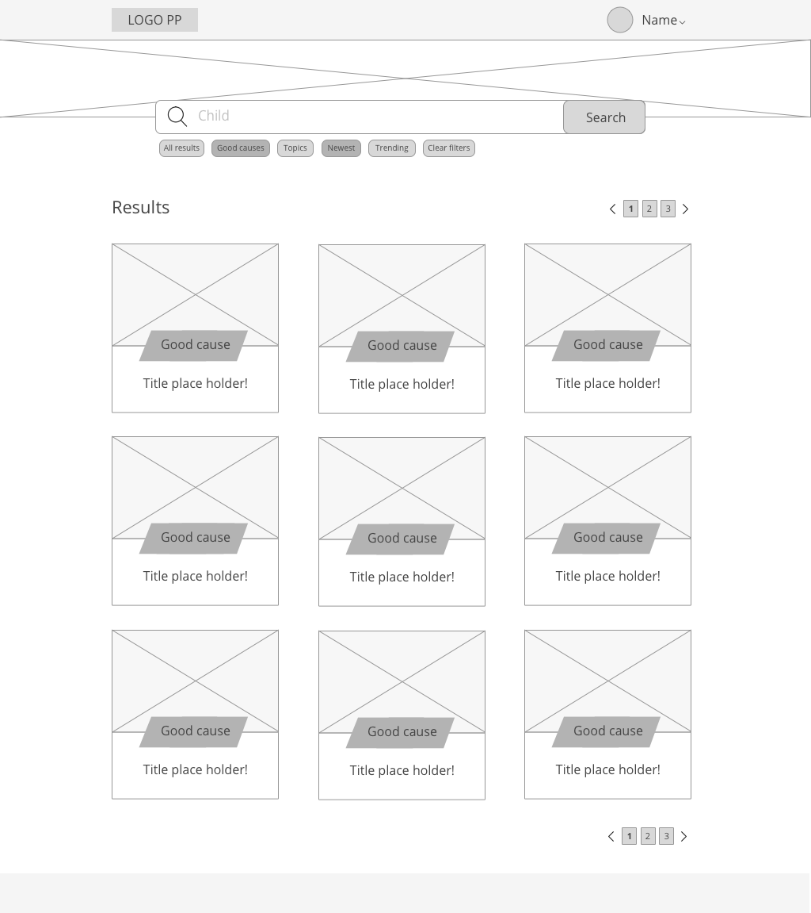
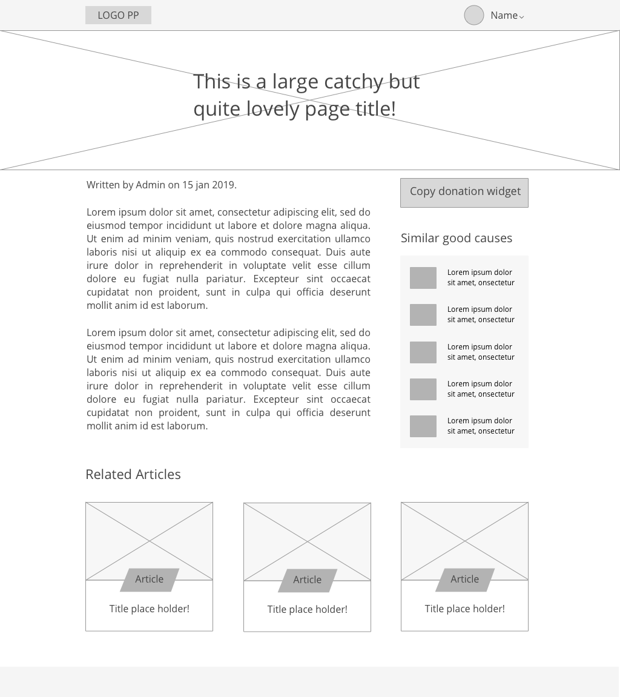

# Low fidelity \(Versie 1.0\)

Na de verkennende fase van het schetsen heb ik de keuze gemaakt om de schetsen te digitaliseren. Hierdoor werd het voor mij makkelijker om iteraties te maken, ook kon ik hierdoor het doel van elk scherm beter communiceren naar andere toe.

Bij samenvoegen van de schetsen zijn de verschillende eisen van de PvE erbij gehouden. Dit zorgde ervoor dat er geen onnodige functionaliteiten werden toegevoegd. 



In de landingspagina zijn de volgende flows verwerkt:  
- Inloggen &gt; Inzage donatie widgets  
- Zoeken naar widgets  
- Aanbevelingen krijgen aan de hand van recente/populaire widgets  
  
De search dropdown weergeeft aanbevelingen aan de hand van de ingevoerde zoekopdracht. 

De zoekresultaten pagina weergeeft verschillende filters, waarin de content gesorteerd kan worden naar de wensen van de gebruiker. Ook worden hier secties weergeven die de goede doelen representeren.

Op de pagina wordt de opbouw van de goede doelen pagina weergeven. Het is hier van belang dat de gebruiker gelijk zien dat hij/zij een donatie widget kan opvragen. 




**Feedback vanuit koen \(design\) & Sam \(dev\):**

Houdt het implementeren van de widget en het aanmaken van een account zo simpel mogelijk. Je hoeft de widget niet te activeren achteraf. Opvragen en dan is hij gewoon actief. Probeer het lean te houden bij het ontwikkelen van dit product.

**Inlog**  
Verschuif de login flow ook naar een andere flow. \(Deze was ter illustratie op de landingspagina geplaatst\) 

**Landingspagina:**  
Verander de headliner nog, het is nog niet duidelijk wat het publisher platform doet en waar het voor staat. Voeg hier de verticals aan toe, zie het nieuwsplatform.

**Eerste contactpunt**  
Kinder is namelijk het eerste contactpunt waar een editor mee in aanraking komt. Het kan zijn dat zij nog nooit in aanraking zijn geweest gekomen met de wereld van goede doelen. Ze kennen wel de Kika of WNF maar dat zijn gewoon losse fragmenten. Er zit natuurlijk veel meer achter wat kinder probeert te bereiken.

**Begeleiding in het zoeken**  
Geef ze daarom ook nog wat meer introductie bij de categorieën, laat ze zien dat het niet alleen 1 onderdeel is maar begeleid hen tijdens het zoeken naar een specifieke iets. Of begeleid ze naar iets toe. Ze kijken en klikken waarschijnlijk nog even rond en als ze dan iets interessants tegenkomen, dan zullen ze daar meer van willen zien.  
&gt; gebruik recognition over recall \(mental notes\).

**Sidenotes**:

* Flow van de user herschrijven en uitdenken.
* Houdt alles zo lean mogelijk met het bedenken van oplossing voor het registreren/ opvragen van widgets.
* Verander de headliner zodat men weet waar de portal voor staat.
* Kinder kan namelijk eerste aanknopingspunt zijn voor veel mensen, begeleidt ze door het zoekproces van content/good causes. Recognition over recall!

  
De feedback zal verwerkt worden in de tweede versie van de wireframes.



