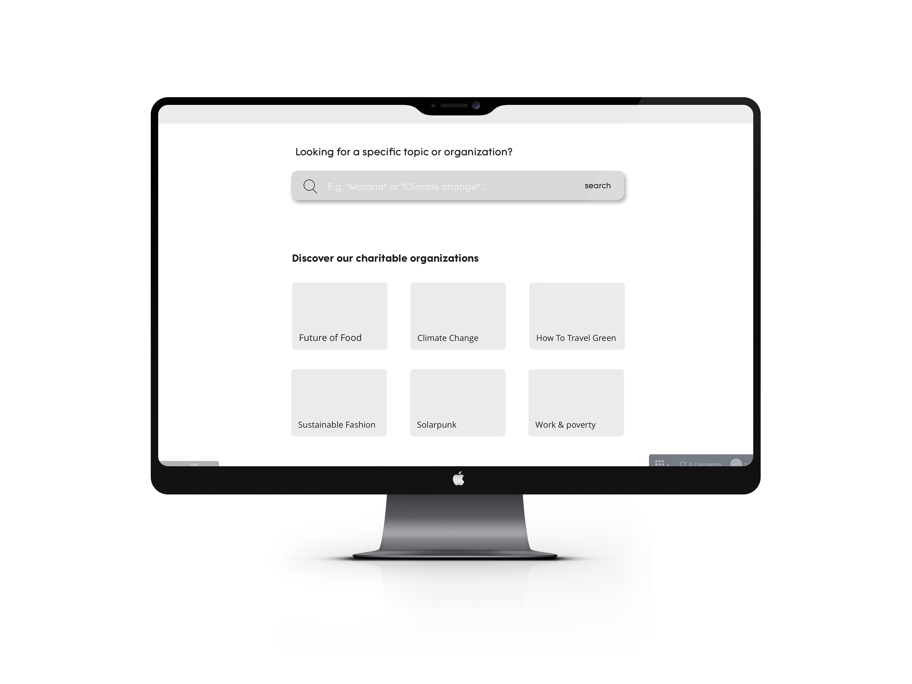
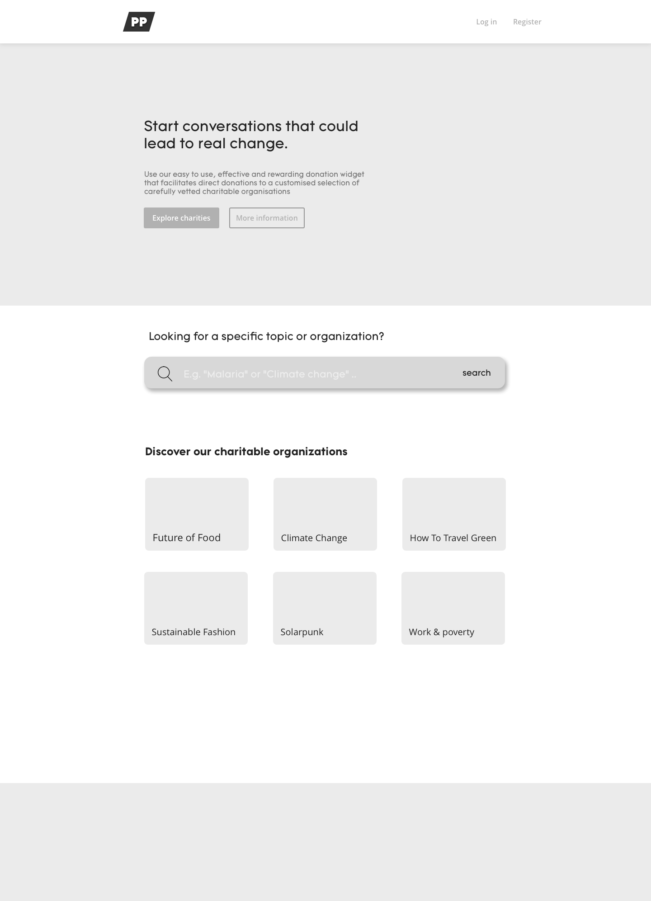
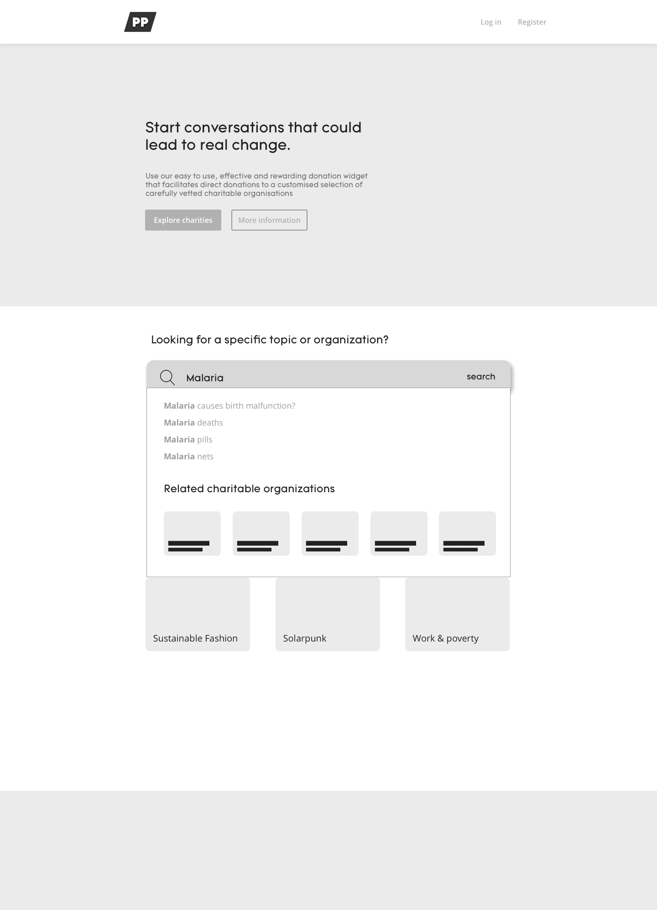
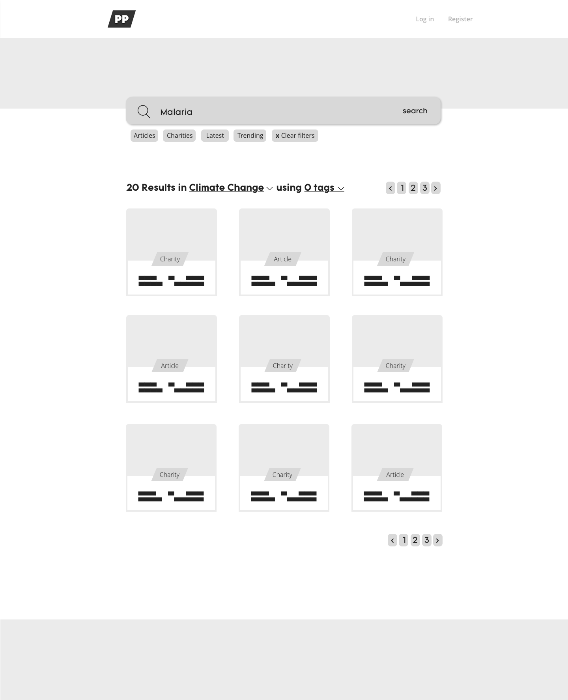
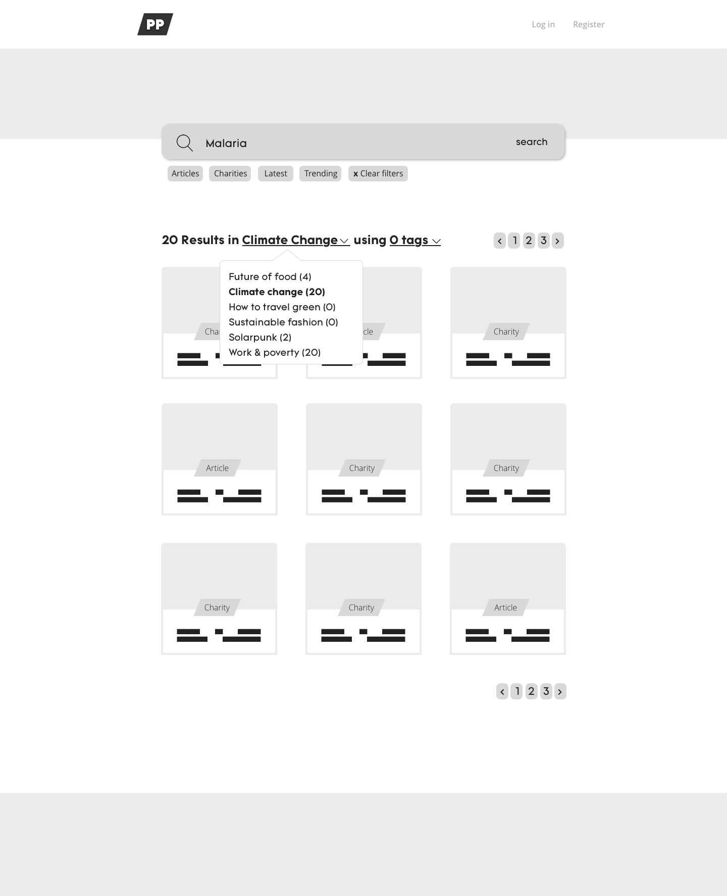
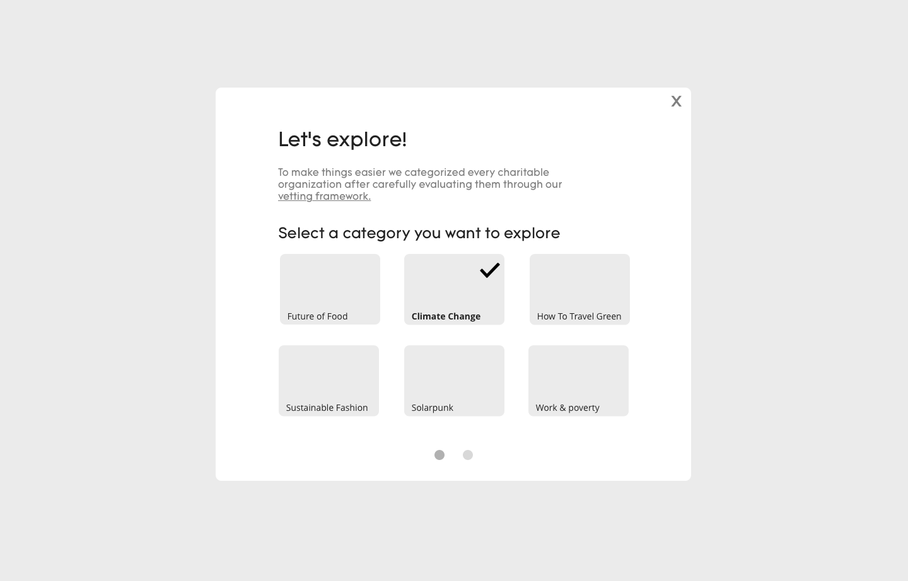
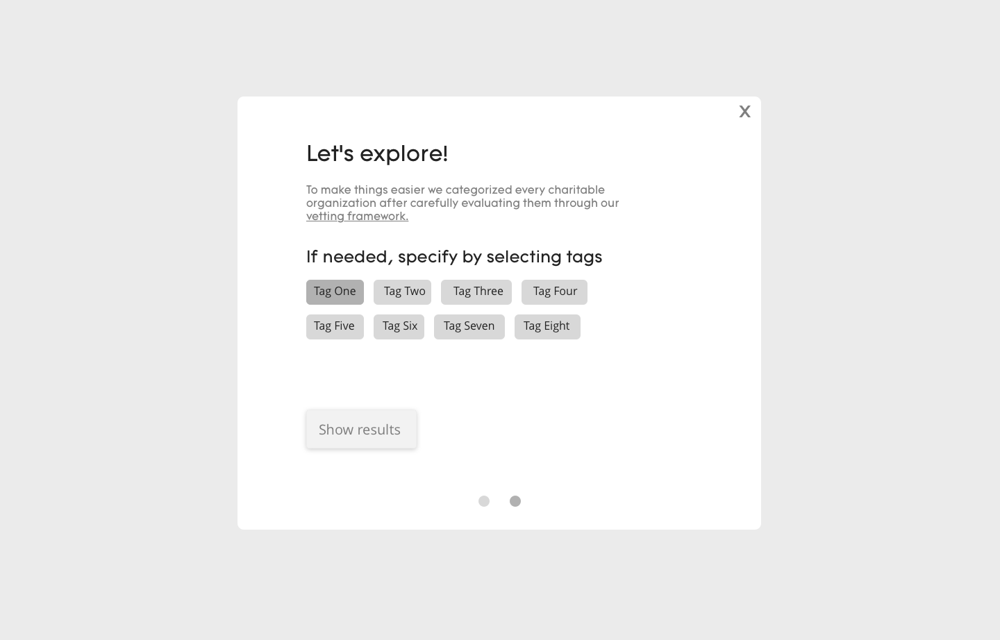
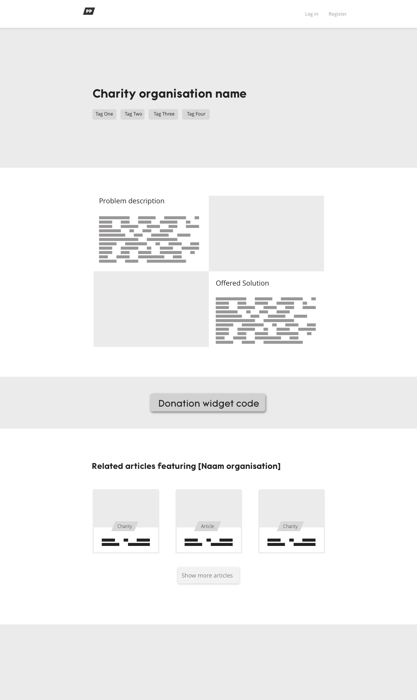
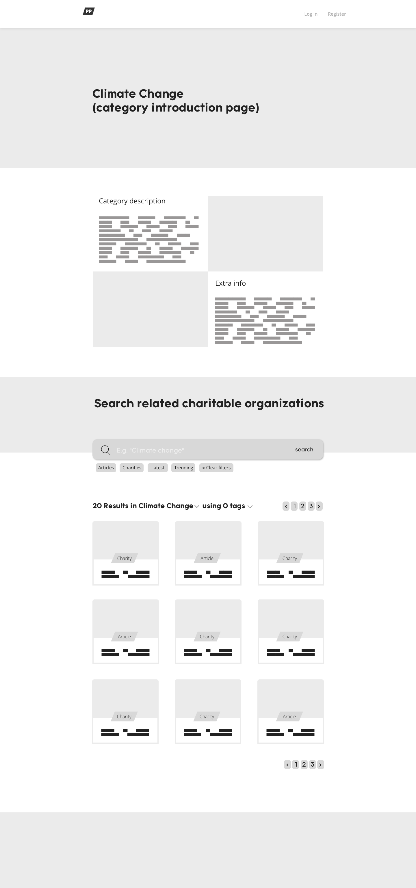
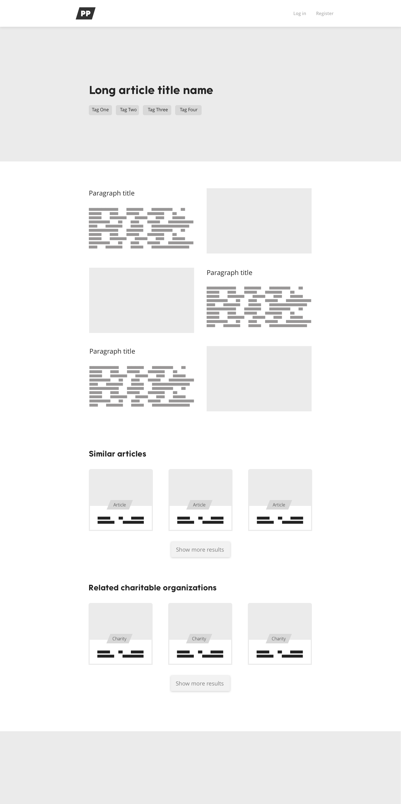

# Medium fidelity \(Versie 2.0\)

Voor de prototype link van versie twee kun je [hier](https://projects.invisionapp.com/d/main?origin=v7#/console/17531277/363384402/build) terecht.   
  
De prototype is snel opgesteld om de functionaliteiten van het platform te testen. Uit de vorige wireframes was het vrij warrig. Door het opstellen van de prototype kon ik sneller te weten komen of het informatie architectuur van het ontwerp logisch en natuurlijk aanvoelden. 

Na het verwerken van de feedback van de eerste wireframes zijn de doelen van de tweede wireframes bijgesteld. Tijdens het samenstellen van de schermen was er te weinig rekening gehouden met een manier waarin aanvullende informatie over het platform gegeven wordt. Het gevolg hiervan was dat er enige informatie mistte waardoor gebruikers niet zouden weten wat zij precies konden bereiken.  
  
Vanuit de feedback van wireframes \(versie 1\) kwam het naar voren dat de langspagina te veel doelen bevatten waardoor de gebruiker niet snel wist waar hij/zij naar toe moest. Hierdoor ben ik de flow en de pagina opnieuw gaan uitdenken. De doelen zijn bijgesteld en richten zich op het volgende: 

1. Gebruikers sturen naar het zoeken.
2. Gebruikers sturen naar begeleiding indien nodig, dit via de aanduiding van de categorieen/ explore functie.
3. Het geven van informatie aanvullend op de informatie vanuit de route waar zij vandaan komen \(Vanuit het nieuwsplatform van Kinder\).



**De zoekbalk:**  
Zodra gebruikers op de zoekbalk klikken veranderd het doel \(van verkennen naar zoeken\) van de gebruiker. Het scherm zal zich ook aanpassen en verschuiven aan de hand van een anchored link \(zie mockup 2\).   
  
Nadat het scherm is versprongen komen hier ook de categorieën in beeld. Deze dienen als ondersteuning wanneer de gebruiker wilt gaan zoeken maar nog niet duidelijk weet waar hij/zij moet zoeken. De categorieen worden bewust bedekt zodra de gebruiker gelijk trefwoorden invoert in de zoekbalk. 

**Explore functie:**  
Deze functie is opgezet ter ondersteuning van het verkennen van de content op het platform. Gebruikers kunnen via een paar simpele stappen een categorie, widget of artikel en de zoektocht specificeren aan de hand van tags. Mocht de gebruiker gericht willen zoeken, dan is dat ook mogelijk. Wel dient deze functie nog getest te worden.  
  
**Search functie:**  
Hierin wordt de titel van de resultaten aangegeven als een filter. 

**Landingspagina:**

**Search pagina:**

**Explore pagina:**

**Goede doelen pagina, Categorieen pagina en Artikel pagina**




