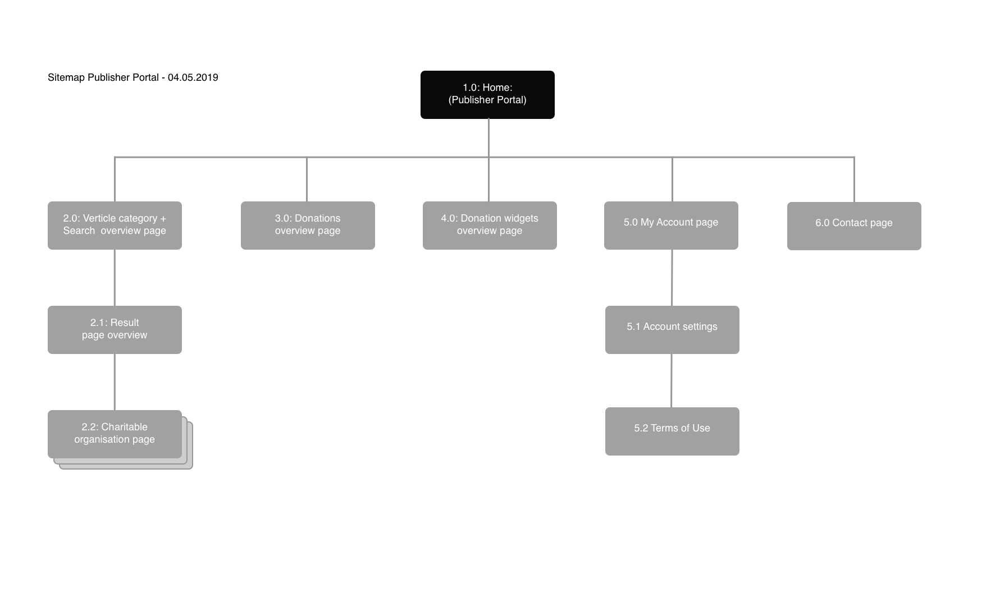

# Sitemap Publisher Portal



Om de structuur van The Publisher Portal beter in kaart te kunnen brengen, is ter verduidelijking de sitemap opgesteld voor het eindproduct.

Hiermee is het duidelijk geworden hoe de website in elkaar zit en waar ik moet zijn voor bepaalde webpagina's. Dit zal mij ook ondersteunen bij ontwerpen van het design voor The Publisher Portal.







