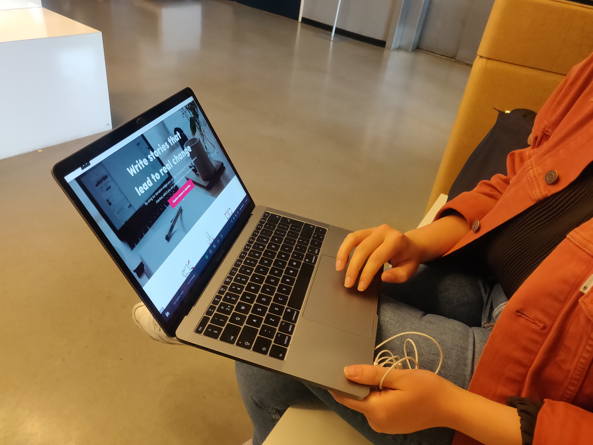
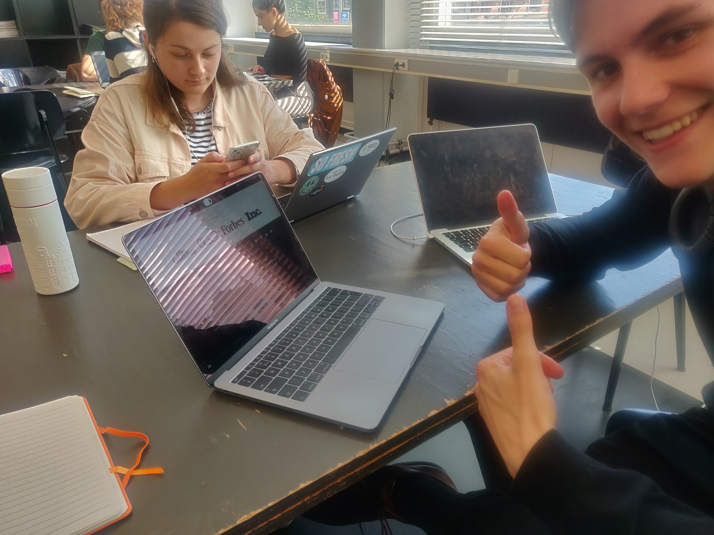

# Testsessie, Peer feedback & Expert review

Gedurende de fases van het ontwerp traject zijn er verschillende momenten geweest waarbij ik feedback heb gevraagd van verschillende expertises, waaronder mede-studenten, Visual Designers \(het team van Kinder\) en een UX Designer.   
  
De keuze om deze expertises om feedback te vragen was gemaakt omdat de groep journalisten, waar ik wel in contact mee kon komen, na de interviews helaas niet meer wilde meewerken. Zij waren na verloop van tijd lastig te bereiken of hadden uiteindelijk geen interesse meer om verder te helpen.   
  
In laatste moment van het project is er nog wel een mogelijkheid verschenen om te kunnen testen met de doelgroep.



**Het testdoel van de eerste wireframe versie:**  
  
- Testen of het hoofddoel duidelijk is  
- Testen of de flow van het scherm duidelijk is.  

**Feedback vanuit koen \(design\) & Sam \(dev\):**

Houdt het implementeren van de widget en het aanmaken van een account zo simpel mogelijk. Je hoeft de widget niet te activeren achteraf. Opvragen en dan is hij gewoon actief. Probeer het lean te houden bij het ontwikkelen van dit product.

**Inlog**  
Verschuif de login flow ook naar een andere flow. \(Deze was ter illustratie op de landingspagina geplaatst\) 

**Landingspagina:**  
Verander de headliner nog, het is nog niet duidelijk wat het publisher platform doet en waar het voor staat. Voeg hier de verticals aan toe, zie het nieuwsplatform.

**Eerste contactpunt**  
Kinder is namelijk het eerste contactpunt waar een editor mee in aanraking komt. Het kan zijn dat zij nog nooit in aanraking zijn geweest gekomen met de wereld van goede doelen. Ze kennen wel de Kika of WNF maar dat zijn gewoon losse fragmenten. Er zit natuurlijk veel meer achter wat kinder probeert te bereiken.

**Begeleiding in het zoeken**  
Geef ze daarom ook nog wat meer introductie bij de categorieën, laat ze zien dat het niet alleen 1 onderdeel is maar begeleid hen tijdens het zoeken naar een specifieke iets. Of begeleid ze naar iets toe. Ze kijken en klikken waarschijnlijk nog even rond en als ze dan iets interessants tegenkomen, dan zullen ze daar meer van willen zien.  
&gt; gebruik recognition over recall \(mental notes\).

**Sidenotes**:

* Flow van de user herschrijven en uitdenken.
* Houdt alles zo lean mogelijk met het bedenken van oplossing voor het registreren/ opvragen van widgets.
* Verander de headliner zodat men weet waar de portal voor staat.
* Kinder kan namelijk eerste aanknopingspunt zijn voor veel mensen, begeleidt ze door het zoekproces van content/good causes. Recognition over recall!



Voor de High Fidelity visuals ben ik gaan zitten met Kari, Visual Design bij Kinder.  
  
Tijdens deze peer feedback ronde wilde ik graag te weten komen of er nog vormgevingpunten waren waar ik rekening mee hield. Stapsgewijs ben ik met haar door het ontwerp gegaan.  
  
**Conclusies vanuit de Peer feedback:  
-** Pas hierin de copywriting van de landingspagina aan.  
- Kader je hoofddoelen van je landingspagina in, het is belangrijk dat gebruikers hier niet over na hoeven te denken.  
- Searchfilters waren niet duidelijk genoeg vormgegeven, deze kun je achter een "More filter" optie verstoppen. Zo ziet het er ook gelijk beter uit.  
- Het aanpassen van de informatie CTA naar een gehele pagina, hier kan de knop worden weggehaald. Dit zorgt ook voor meer rust.  
- Update aangepaste huisstijl doorvoeren  
  
**Volledige bevindingen:**



\*\*\*\*



In een van de laatste coachingsmomenten kreeg ik een waardevolle tip vanuit de coaching groep om langs de Hogeschool van Utrecht te gaan. Gedurende het project was dit mij helemaal ontschoten dat ik een deel van mijn doelgroep hier ook kon vinden. Gelukkig kon ik tijdens de tentamenperiode nog een paar studenten spreken die te maken hadden met de opleiding Journalistiek. Hieruit zijn de volgende bevindingen gekomen  
  
**Het doel van het testen:**  
Mijn testdoelen gedurende deze korte usability testen lagen vooral op de vormgeving en de copywriting van het concept. De copywriting is namelijk meerdere malen aangepast en blijkt hierin nog steeds een aandachtspunt te zijn.   
  
**Feedback vanuit het testen:**  
- 40-60% verdienen van de geworven donaties is erg hoog. Het moet ook winstgevend zijn voor de organisatie van het goede doel.  
- De headers van de informatie sectie moeten iets meer aangescherpt worden, veel gebruikers scande deze alleen zonder de tekst daaronder te lezen.  
- De filter "sorteer op" gaf onduidelijkheid, het was hierin niet duidelijk waar hij standaard op gefilterd stond.    
- De categorie omschrijvingen op de landingspagina werden wel gelezen, echter werd er wel aangegeven dat de informatie op de gehele categorie pagina onnodig was.  
- Filters van de search kwamen niet prominent genoeg naar voren. Hierdoor keken twee tester eroverheen. Deze zagen ze later pas toen zij terug scrolden.  
  
  
**Enkele deelnemers van de test:**

**Volledige bevindingen:**  
Volledige bevindingen uit de usability test. De bevindingen vanuit de test waren erg kort opgeschreven maar gaven mij genoeg inzichten om aanpassen te kunnen maken.





Voor mijn Expert review wilde ik nog even zitten met Davide, Head Editor bij KInder. Ik wilde graag nog zijn adviezen over de copywriting van de teksten in mijn designs. Ook wilde ik nog even peilen hoe hij nu over het concept dacht, nu dat deze wat meer vorm heeft gekregen dan de huidige versie van The Publisher Portal.

**De volgende conclusies zijn daaruit gekomen:**  
- Davide geeft aan dat het platform makkelijk te gebruiken is.  
- De copywriting kan op bepaalde vlakken nog iets persoonlijker opgesteld worden. Leg hierin weer dat de schrijver de lezer empowered. Een veel voorkomend ding tegenwoordig is dat lezers zich machteloos voelen na het lezen van een artikel. De donatie widget biedt hier een goede omlossing voor \(emotie omzetten naar steun\).  
- De standaard percentages van de donaties zijn aan de hoge kant, maar het is positief dat de er een functie is ingezet waarin de gebruiker zelf kan kiezen hoeveel hij/zij krijgt.  
- Een laatste CTA aan de onderkant van de pagina zal als goed steuntje dienen, hierin hoeft de gebruiker ook niet helemaal naar boven te scrollen.  
  
Voor het hele Expert Review:





