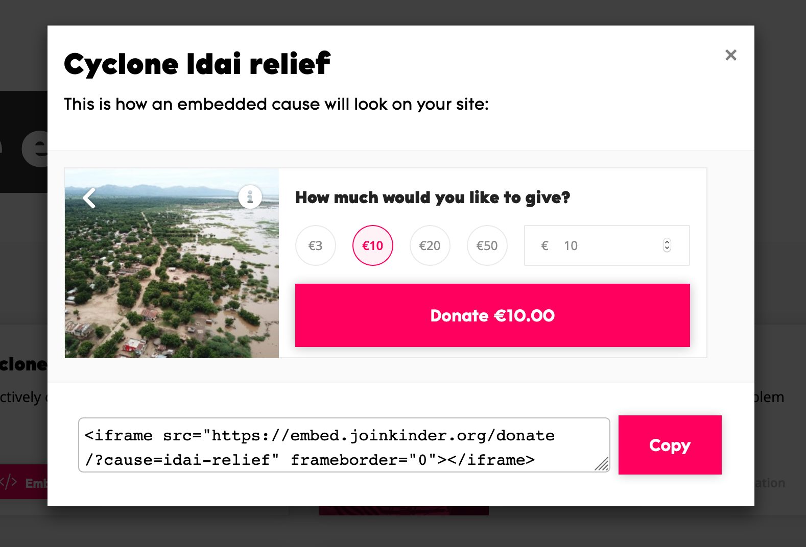
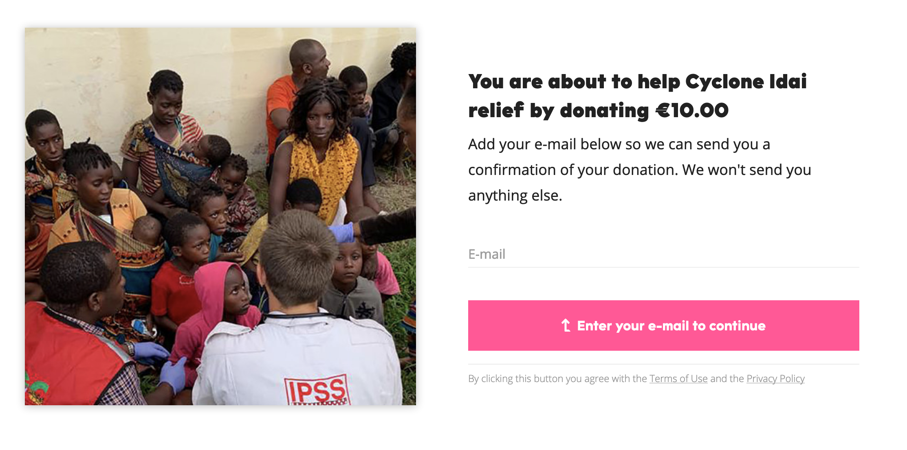

# Info over Kinder

De tools hieronder zullen toelichten hoe dit precies in zijn werk gaat. Ook zal er aanvullende informatie worden gegeven ter verduidelijking.   
  
The Publisher Portal zijn een verlengde zijn van het Kinder.World platform. Voor dit project kan de doelgroep via een link op het nieuwsplatform Kinder.World terecht kunnen komen op The Publisher Portal.



**Verspreid het nieuws, Kinder.World**

Kinder heeft een nieuwsplatform \(Kinder.World\) opgezet waarmee zij het nieuws delen in de wereld van het goed doen. Hier schrijven en publiceren zij zelf artikelen over verschillende onderwerpen die goed gaan maar ook over onderwerpen die slecht gaan. 

Door de positieve maar ook negatieve punten te adresseren laten zij op een transparante manier zien wat er werkelijk gebeurd rondom de goede doelen sector. Een ander punt is dat zij hiermee ook meer awareness rondom verschillende onderwerpen creëren. Daarnaast schrijven zij ook over onderwerpen of punten die lezers zelf kunnen ondernemen om onze wereld een betere plek te maken.




Een ander product waarmee ze het proces van het doneren makkelijker maken is hun donatie widget. In vrijwel alle gevallen dien je in het proces van doneren vaak veel persoonlijke gegevens te registreren \(zie bijvoorbeeld: [WNF](https://www.wnf.nl/doe-mee/geef-een-gift/eenmalige-gift.htm), [KWF](https://secure.kwf.nl/doneren), [IWAF](https://secure.ifaw.org/nederland/secure/word-voorvechter-voor-dieren)\). 

Kinder heeft een widget ontwikkeld waarmee je geheel vrij-blijvend kunt doneren. Je zit hier niet vast aan maandelijkse verplichtingen. Ook vragen zij niet meer dan alleen je email adres om het doneren af te kunnen ronden. 

Het proces van doneren wordt hierdoor een stuk laagdrempeliger en vereenvoudigd voor de donateurs. Het handige van deze widget is dat deze in de content van je CMS te plaatsen is. De lezers van een online artikel kunnen hierdoor gelijk hun steun omzetten in donaties. De donatie widgets zijn gekoppeld aan een goed doel, die positief door hun onderzoeksframework is gekomen.




Als derde hebben zij hun onderzoek en consultancy waarbij ze uiteindelijk stapsgewijs alle goede doelen en bijbehorende organisaties ter wereld door hun Vetting Framework heen halen. Het onderzoeksframework ontwikkeld in samenwerking met de TU Delft.

 Kinder evalueert deze goede doelen en de bijbehorende organisaties op 4 aspecten: transparantie, accountability, effectiviteit en hoe impactvol deze organisaties zijn.   
  
Wanneer een organisaties positief door de evaluatie heen komt, dan is het duidelijk dat deze voldoet aan de hoge standaarden waar Kinder hen op beoordeeld. De data vanuit de framework wordt weer als adviesrapport voorgelegd aan andere goede doelen zodat ook zij aan de hand van het advies zich naar de gestelde eisen kunnen toewerken.




