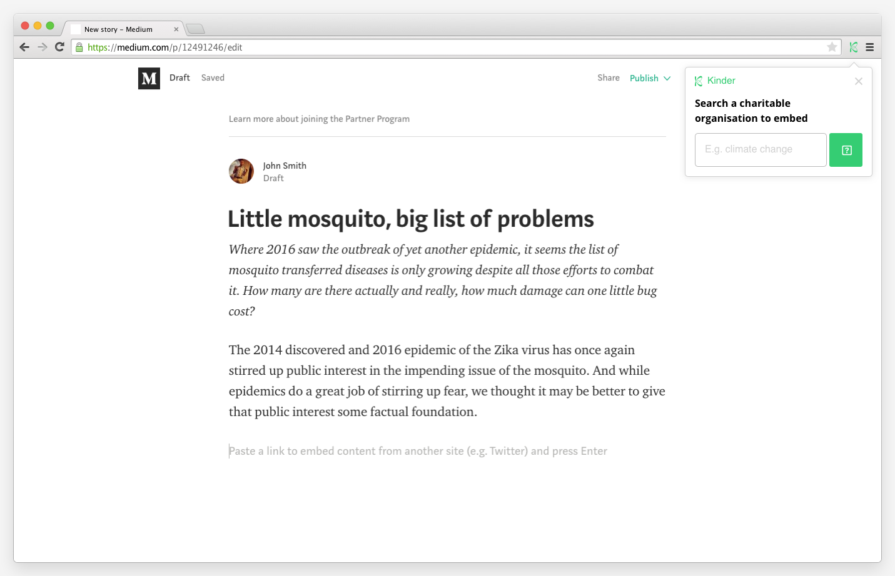
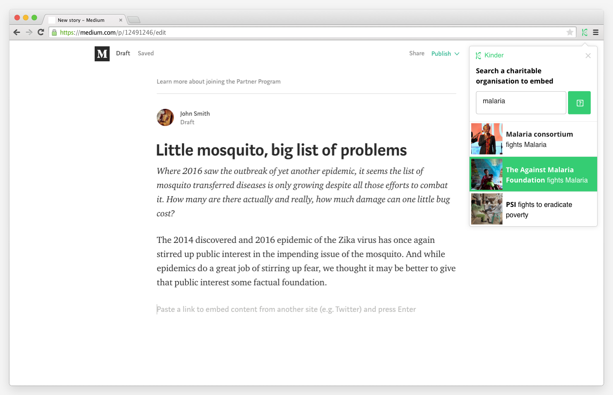
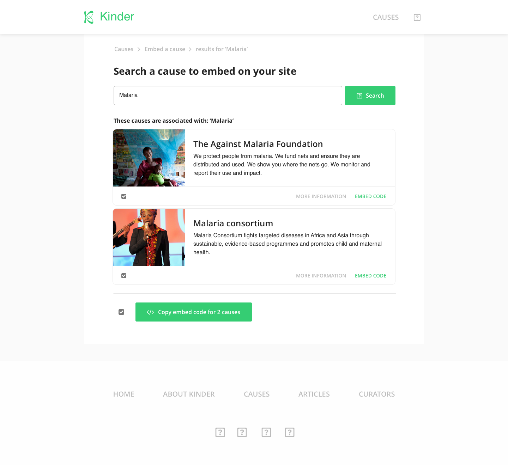
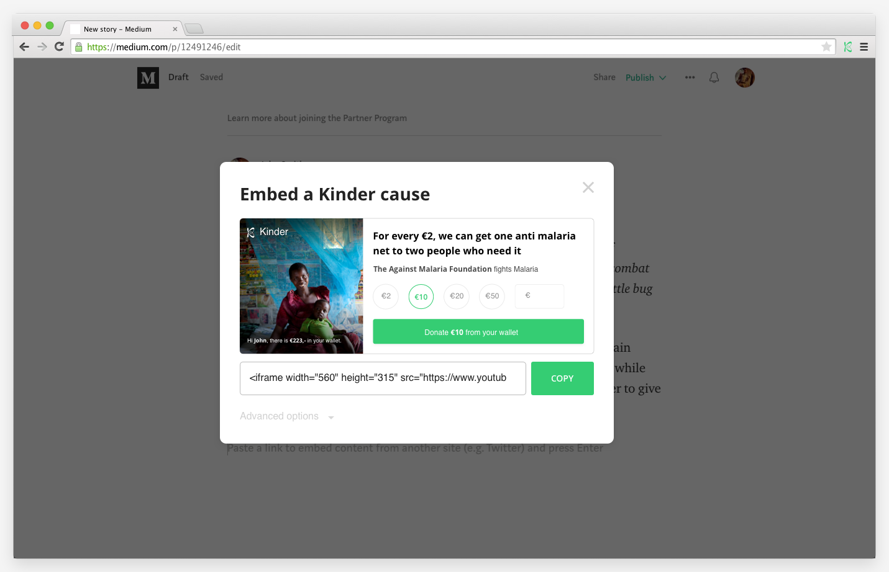

# De browser extensie

Kinder heeft in de periode van het valideren van The Publisher Portal een browser extensie bedacht waarmee gebruikers snel konden zoeken terwijl zij actief zijn in hun webbrowser.

De eerdere versie heeft alleen de mogelijkheid om via de extensie gelijk te kunnen zoeken in de database van goede doelen en de bijbehorende widgets.   
  
Voor het ontwikkelen van The Publisher Portal zal de widget verder worden onderzocht, en toegepast worden als trigger om de gebruiker terug te laten komen naar het platform.

De functionaliteiten en de abstracte werking zijn in een korte brainstorm sessie met Sam \(Tech Lead\) samen gesteld.



**Werking**:

De browser extensie detecteert het gebruik van online text editors \(zoals Google Docs, CMS systemen, webbrowser based Evernote, etc., dit sluit aan bij de resultaten van de artefact analyse\). Buiten deze tools zal de browser extensie niet actief zijn in verband met de detectie functie of vanwege Privacy.

Via het algorithme kan de browser extensie de stukken text in de editor uitlezen. De extensie zal na een x aantal woorden een suggestie van widgets geven aan de hand van de overeenkomende woorden in de getypte tekst. Het aantal woorden waarna de extensie een aanbeveling zal gaan doen wordt bepaald tijdens het aanmaken van een account. De woorden in de text worden vergeleken met de metadata uit database van het Vetting Framework \(Het framework waarmee Kinder goede doelen evalueert\). 

Voorbeeld: De gebruiker dient bij het aanmaken van een account aangeven uit hoeveel woorden zijn gebruikelijke artikelen bestaan, dit kan bijvoorbeeld 200-300, 300-400, 400-500, etc. Op basis van deze input zal de extensie de tekst uitlezen en op 75% van het aantal woorden een aanbeveling geven van topic gerelateerde donatiewidgets. 

**Aanbevelingen van Widgets**:

De overeenkomsten met de tekst zullen vervolgens via een popup weergeven worden in de browser. De gebruiker kan vervolgens met een paar kliks de gerelateerde widget kopieren, of hij kan via de extensie zelf zoeken naar andere gerelateerde widgets.

**Remarks:**  
Wel moet hier aangegeven worden dat de extensie niet altijd een accurate aanbeveling kan doen. Dit komt voor wanneer de gebruiker een artikel schrijft met een lager aantal woorden dan hij heeft aangegeven. 



De V1 maakt hierin alleen gebruik een zoekfunctie in de browser extensie. Waarbij de gebruiker de text editor dient te verlaten voor het zoeken van een widget. Dit breekt voornamelijk de flow van de gebruiker op en verhoogt hiermee de kans dat de gebruiker dit overslaat of hier van af staat.




