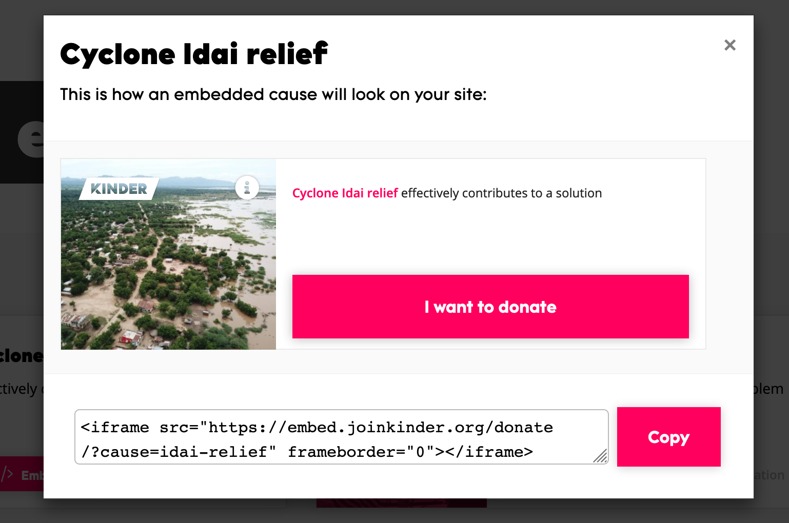
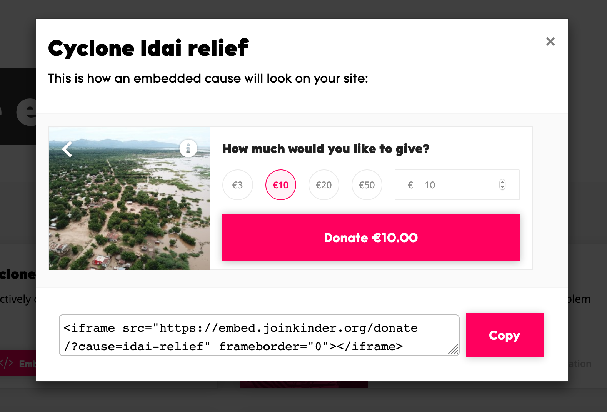
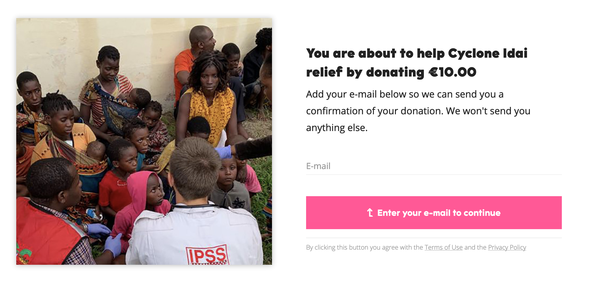
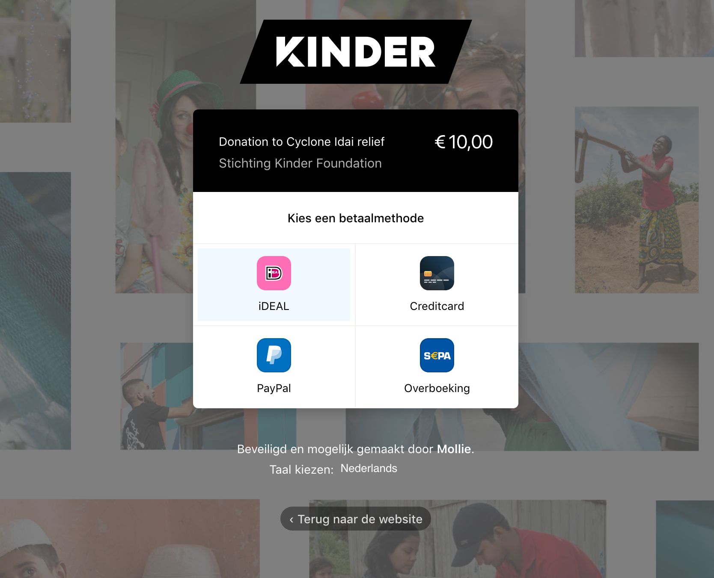

# De donatie widgets



Een ander product waarmee ze het proces van het doneren makkelijker maken is hun donatie widget. In vrijwel alle gevallen dien je in het proces van doneren vaak veel persoonlijke gegevens te registreren \(zie bijvoorbeeld: [WNF](https://www.wnf.nl/doe-mee/geef-een-gift/eenmalige-gift.htm), [KWF](https://secure.kwf.nl/doneren), [IWAF](https://secure.ifaw.org/nederland/secure/word-voorvechter-voor-dieren)\). 

Kinder heeft een widget ontwikkeld waarmee je geheel vrijblijvend kunt doneren. Je zit hier niet vast aan maandelijkse verplichtingen. Ook vragen zij niet meer dan je email adres om het doneren af te kunnen ronden. 

Het proces van doneren wordt hierdoor een stuk laagdrempeliger en vereenvoudigd voor de donateurs. De gebruikers kunnen de embed code van de widget opvragen, deze wordt namelijk aangeleverd in een iframe. Het handige van deze widget is dat deze in de content van je CMS kunt plaatsen. Zodra content online komt te staan, krijgen de lezers van een  artikel een widget te zien waarmee zij hun steun omzetten in donaties.   
  
Elke goed doel wordt gekoppeld aan een widget zodra deze positief door de evaluatie van het onderzoeksframework is gekomen.



Dit is de standaard weergaven van de widget, deze kan qua design nog varieren.




